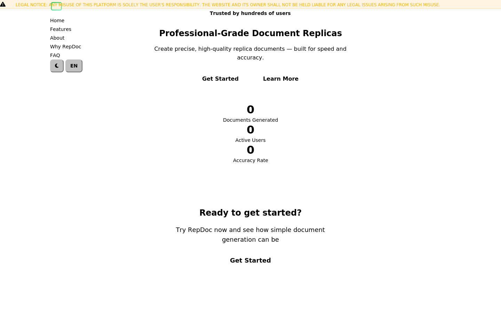
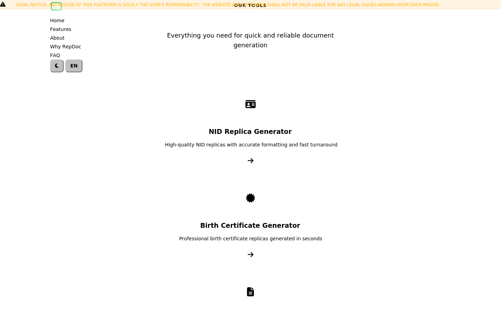

# RepDoc

Professional replica document generation platform. Fast, secure, and reliable.

## Pages

- **Home** — Hero section with particle animations, stats, and CTAs
- **Features** — Tool cards for NID, Birth Certificate, Prottoyon generators + coming soon items
- **About** — Platform overview and mission
- **Why RepDoc** — Benefit highlights with animated counters
- **FAQ** — Accordion-style frequently asked questions

## Screenshots

### Home page



### Features page



## Tech Stack

- PHP (templating, includes)
- HTML5
- CSS3 (custom properties, flexbox, grid, animations, glassmorphism)
- JavaScript (canvas particles, i18n, theme toggle, scroll reveal, counters, FAQ accordion)

## Features

- Dark/light theme toggle with localStorage persistence
- Bangla/English language toggle with full i18n
- Responsive design (mobile, tablet, desktop)
- Animated particle canvas background with mouse interaction
- Scroll-triggered reveal animations
- Animated counters
- Sticky glassmorphism navbar

## Run Locally

```bash
php -S 0.0.0.0:8080
```

Then open `http://localhost:8080` in your browser.

## License

MIT
